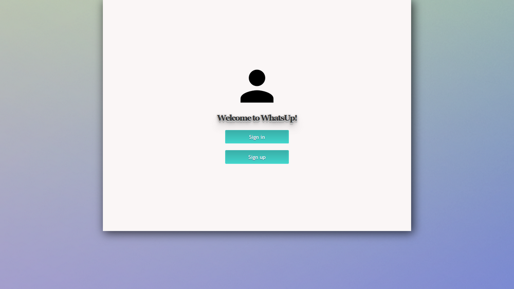
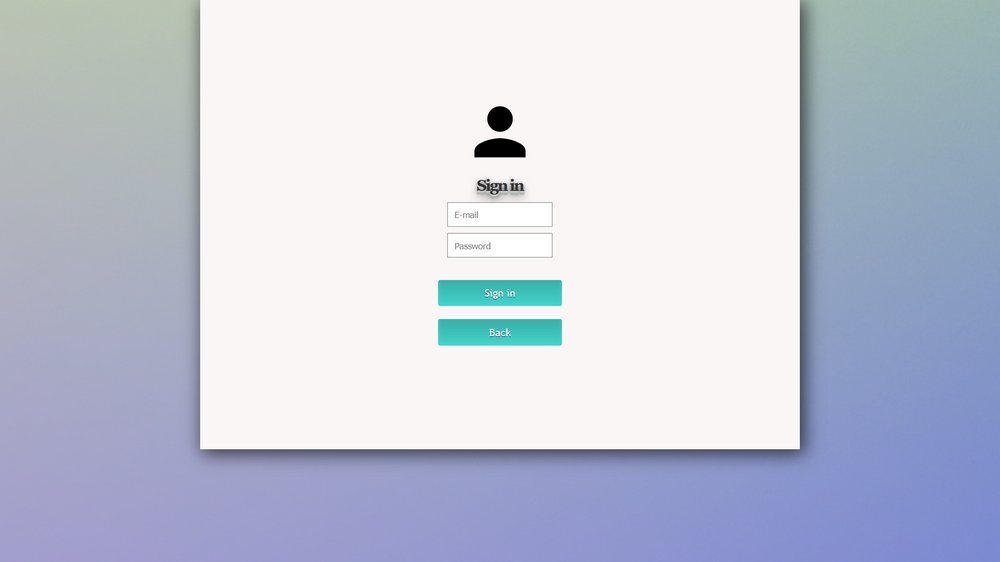
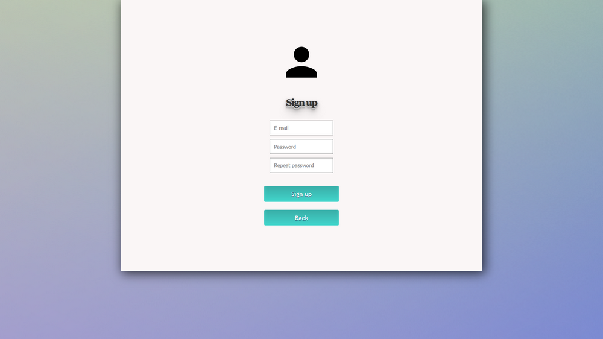
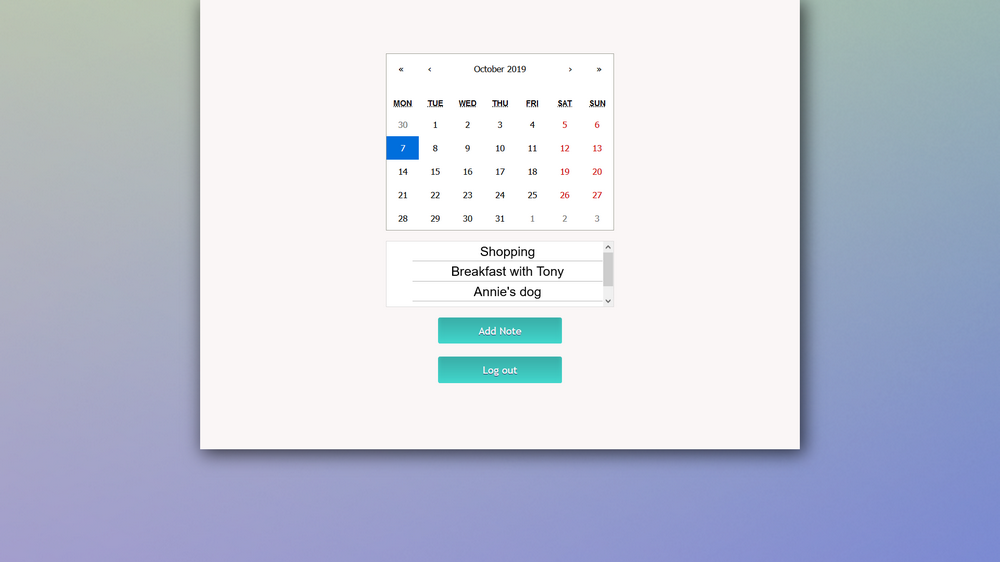
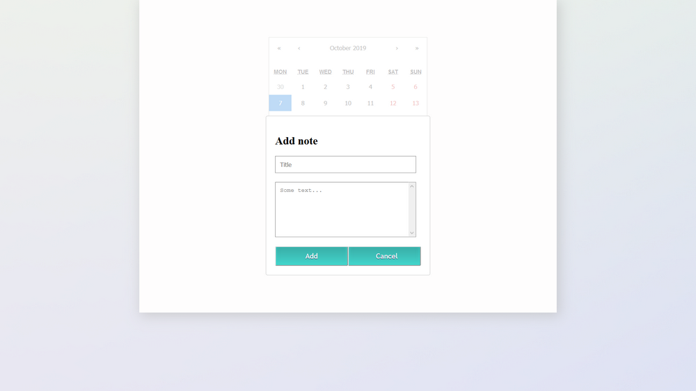
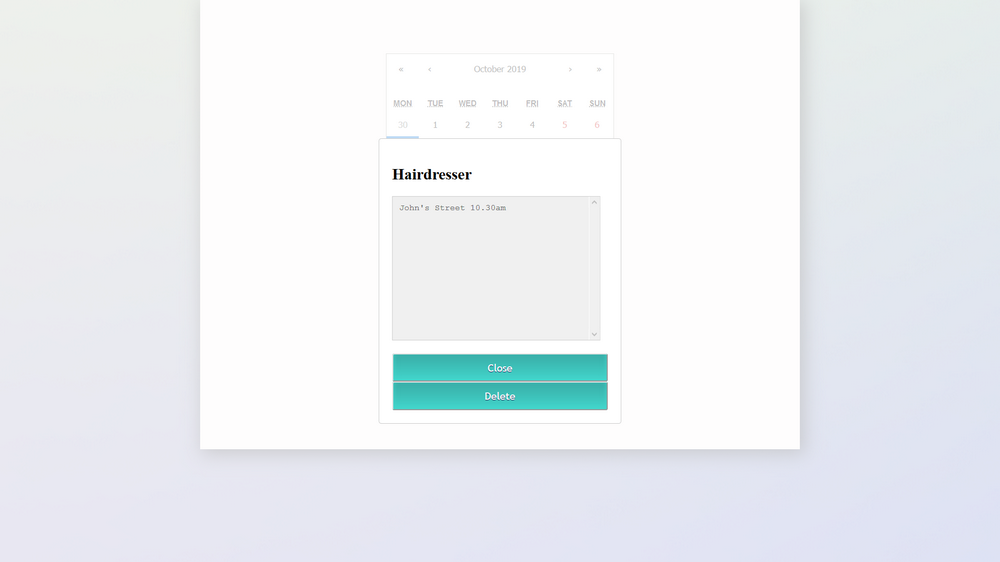

<p align="center">
	:blue_book: :calendar: :clock3:
</p>
<h1 align="center">
	WhatsUp
</h1>

> Web application that is the equivalent of a journal which allows each person to keep their own personal calendar, organizer.

## Table of contents
* [Introduction](#introduction)
* [Features](#features)
* [Technologies](#technologies)
* [Demo](#demo)
* [Screenshots](#screenshots)
* [Setup](#setup)
* [License](#license)

## Introduction
**WhatsUp** is an web application that allows to keep **journal, calendar, organizer with notes**.
</br></br>
Each user can **create his own account** and **add notes** to a **specific date** in **calendar component**.
</br></br>
The note consists of title and description. **Every added note** can be **shown or deleted** later.
</br></br>
**The great convenience** is that you can **store all data on your own account**.
</br></br>
An application was tested on *Mozilla Firefox 69.0.1*.
</br></br>
Created in **Javascript** using **React** framework & **Firebase** platform for storing database. Additionally, there were used libs like: **react-calendar**, **react-modal** and **react-router-dom**.

*Project was made as a part of an internship education in [TDSoft](https://tdsoft.pl)*

## Features
* Create your own account
* Store data in realtime database
* Calendar component
* Adding notes to specific dates
* Note consists of title and description
* Reviewing created notes for specific days
* Removing created notes

## Technologies
* Node.js 10.15.3
* JavaScript (ES6)
* Firebase 6.3.1, Realtime Database
* ReactJS 16.8.6
* React-Calendar 2.19.0
* React-Modal 3.9.1
* React-Router-Dom 5.0.1

## Demo
[Live demo](https://whatsup-2031c.firebaseapp.com)

## Screenshots
<p align="center">
	
	
	
	
	
	
</p>


## Setup
* [Install Node.js](https://nodejs.org/en/download/)
* Clone repository
```
git clone https://github.com/mroui/whats-up.git
```
* Enter the main folder `whats-up`
* Update npm, just in case (Node Package Manager, it comes with node.js installation)
```
npm install -g npm
```
* Install NPM Dependencies
```
npm install
```
* Create Firebase project and add the project configurations to the ./src/firebase/config.js file -> 
[Instruction](https://firebase.google.com/docs/web/setup)
The config.js file should looks like:
```
import firebase from 'firebase';

  const firebaseConfig = {
		apiKey: "api-key",
		authDomain: "project-id.firebaseapp.com",
		databaseURL: "https://project-id.firebaseio.com",
		projectId: "project-id",
		storageBucket: "project-id.appspot.com",
		messagingSenderId: "sender-id",
		appId: "app-id",
		measurementId: "G-measurement-id",
    };

  const fire = firebase.initializeApp(firebaseConfig);

  export default fire;
```
* Launch App
```
npm start
```

## License
This project is licensed under the terms of the MIT license.